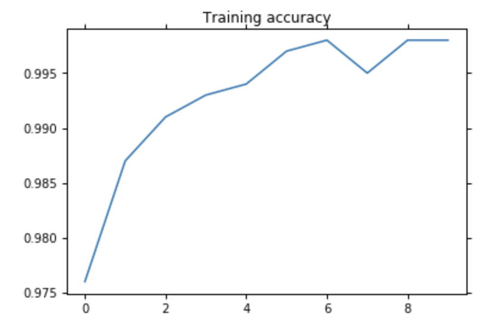
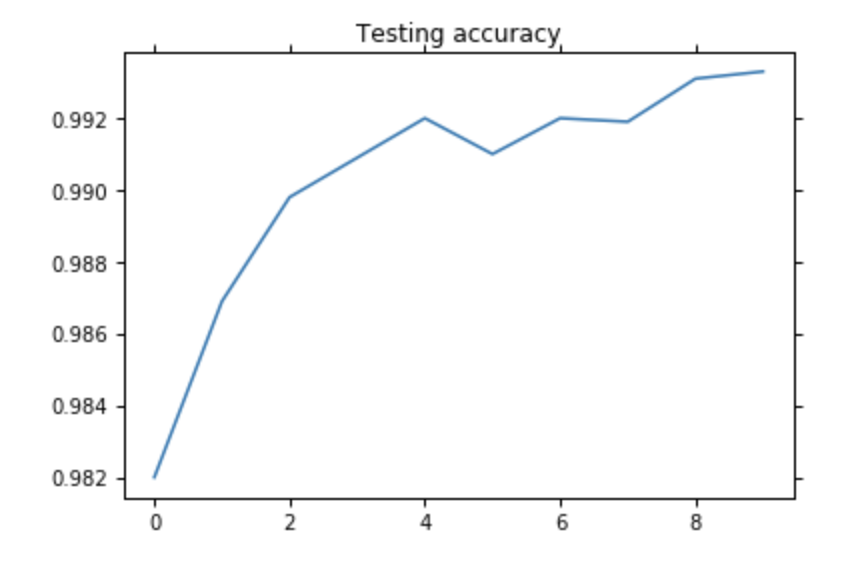

# Capsule-Networks-Notebook-MNIST
This implementation is similar to the paper, I've only done classification, and not reconstruction. If you find any issues or can help make the code more readable, please reach out to me at sriram@ucsd.edu. This implementation is similar to gram.ai's implementation, but this one should run a bit faster. <br><br>

I've mentioned the size of each variable after the corresponding line, for easy understanding.

## Requirements
* PyTorch 0.2+
* Python 2
* Torchvision (for MNIST)

## Usage
Capsule Networks Notebook.ipynb <br>
* GPU - 
Just ```shift+return``` everything, it should run just fine. The code was meant for people to understand and requires some effort to repurpose (values are hardcoded).
* No GPU - 
It's super slow but make sure to remove ```.cuda()``` from everywhere in the code. 

## Results
I got 99.4% testing accuracy at the end of 24th epoch and didn't have patience to run more. For 10 epochs, I obtained 99.33% test accuracy.




## Credits
* @iwasaki-kenta for his implementation. 
* Aurelion Geron for his excellent explanation. https://www.youtube.com/watch?v=pPN8d0E3900

## Paper
Dynamic Routing between Capsules by Sara Sabour, Nicholas Frosst, and Geoffrey E. Hinton. https://arxiv.org/abs/1710.09829
